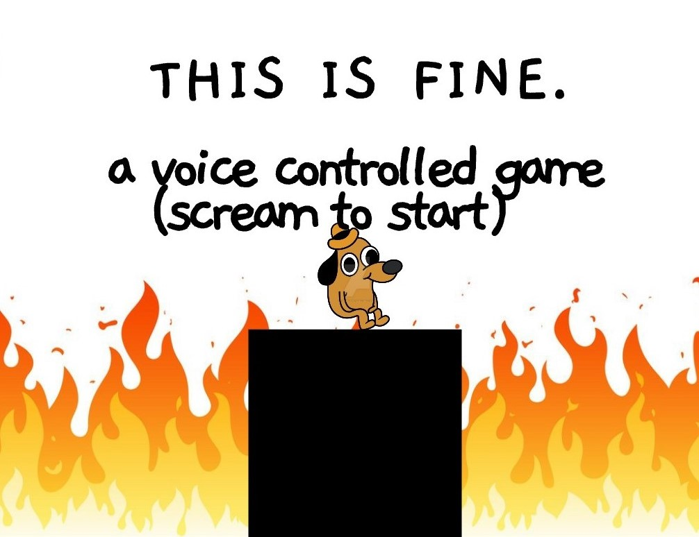

# CS 126 FinalProject

## Project title
THIS IS FINE: A voice controlled game.

## How To Play
Scream to start the game. The player's movements are controlled by the noises you make. The loouder you are, the higher the player will jump.
Press 'r' to return to the start screen
 
## Screenshots

## Tech/framework used
Made using c++ and Microsoft Visual Studio

## Libraries/Addons
* ofxBox2d
* openFrameworks

## Credits:
Inspired by:
* the voice controlled game "Don't Stop! Eighth Note!" https://itunes.apple.com/us/app/dont-stop-eighth-note-voice-control-game/id1209708560?mt=8
* my freshman year of college
* this dog: 

